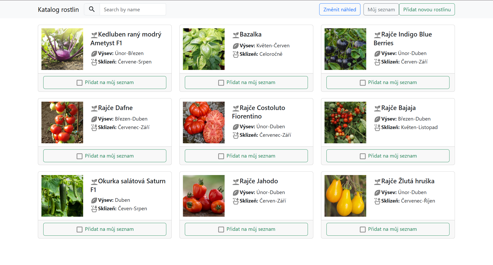
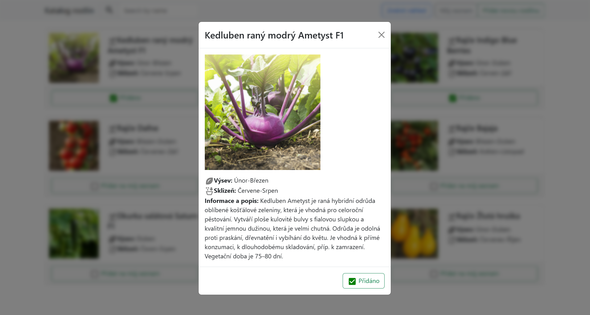
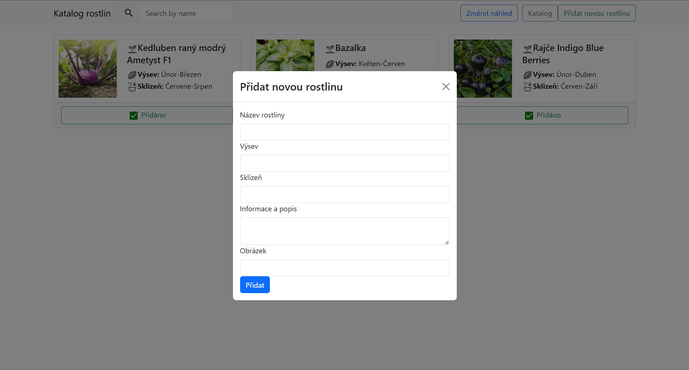
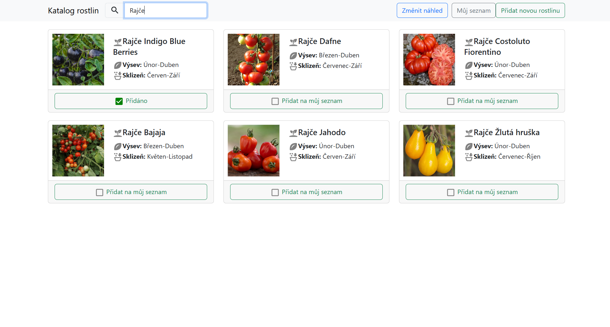

# Garden Diary

Webová aplikace pro správu zahrady a plánování pěstování rostlin.

## Funkce

- katalog rostlin
- evidence vysazených rostlin
- plánování výsadby
- CRUD operace nad rostlinami a plány
- REST API

## Použité technologie

### Frontend
- React
- JavaScript
- HTML
- CSS
- Bootstrap

### Backend
- Node.js
- Express

## Struktura projektu

```text
/client  - React frontend
/server  - REST API backend
```

## Spuštění

### Frontend

```bash
cd client
npm install
npm start
```

### Backend

```bash
cd server
npm install
npm start
```

## Autor

Anastasie Žďárská

## Ukázky aplikace

### Hlavní stránka



### Detail rostliny



### Přidání nové rostliny



### Vyhledávání

